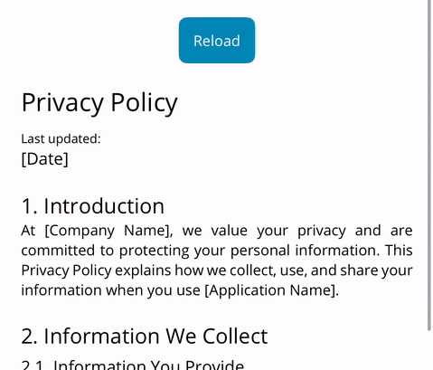

[🇺🇸 EN](README.md) | 🇪🇸 ES

# JsonVisualizer

JsonVisualizer es una utilidad para .NET MAUI que te permite crear dinámicamente un CollectionView a partir de archivos JSON. Los archivos JSON deben estar ubicados en `Resources/Raw/`.

<div style="margin: 20px 0;">
  
</div>

## Características

- Cargar dinámicamente cualquier archivo JSON de recursos

## Instalación

Para instalar JsonVisualizer, ejecuta el siguiente comando en la Consola del Administrador de Paquetes NuGet:

```sh
dotnet add package FreakzDEV.JsonVisualizer --version 1.0.2
```

<div style="margin: 20px 0;">
  <a href="https://www.nuget.org/packages/FreakzDEV.JsonVisualizer" style="text-decoration: none;color: #004880;">
  <div style="display: inline-flex;gap:10px;align-items: center;">
    
    <span style="font-weight: 900; font-size: 20px;">Paquete Nuget</span>
  </div>
  </a>
</div>

## Versión

Versión actual: 1.0.0

## Propiedades
<table style="border: 1px solid #4d4d4d50;">
  <tr style="font-weight: 900;background-color:#4d4d4d20;"><td>Propiedad</td><td>Descripción</td><td>Valor Predeterminado</td></tr>
  <tr><td style="font-weight: 600;">File</td><td>Define el nombre del archivo de recursos Json: [File].json.</td><td>string.Empty</td></tr>
  <tr>
</table>

## Estructura del archivo JSON
```json
[
  {
  "Text": "Este es el título", // string
  "Size": "Title", // Small | Medium | Large | Title | Default
  "Attributes": "Bold", // Bold | Italic | None
  "marginTop": 20 // double
  }
]
```

En el directorio `assets`, hay un archivo JSON de muestra llamado `Test.json`.

<div style="margin: 20px 0;">
  
</div>

## Uso

Primero, agrega el espacio de nombres a tu archivo XAML:

```xml
xmlns:JsonVisualizer="clr-namespace:FreakzDEV.JsonVisualizer;assembly=FreakzDEV.JsonVisualizer"
```

Luego, puedes usar el control `JsonVisualizer` en tu XAML:

```xml
<JsonVisualizer:Collection File="{Binding JsonFile}" />
```

## Ejemplo

Aquí tienes un ejemplo de cómo usar la biblioteca JsonVisualizer en tu aplicación .NET MAUI:

```xml
<?xml version="1.0" encoding="utf-8" ?>
<ContentPage 
  xmlns="http://schemas.microsoft.com/dotnet/2021/maui"
  xmlns:x="http://schemas.microsoft.com/winfx/2009/xaml"
  x:Class="App.Devs.View"
  xmlns:local="clr-namespace:App.Devs"
  ios:Page.UseSafeArea="False"
  x:DataType="local:ViewModel"
  xmlns:JsonVisualizer="clr-namespace:FreakzDEV.JsonVisualizer;assembly=FreakzDEV.JsonVisualizer">
  <ScrollView>
  <VerticalStackLayout Padding="20,40,20,40" VerticalOptions="Fill" HorizontalOptions="Fill">
    <JsonVisualizer:Collection File="{Binding JsonFile}" Margin="0,20,0,0"/>
  </VerticalStackLayout>
  </ScrollView>
</ContentPage>
```
## Ejemplo

<div style="margin: 20px 0;">
  
</div>

## Licencia

Este proyecto está licenciado bajo la Licencia MIT.

## Contacto

Para cualquier pregunta o comentario, por favor contáctanos en [support@freakz.dev](mailto:support@freakz.dev).