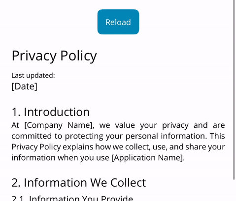
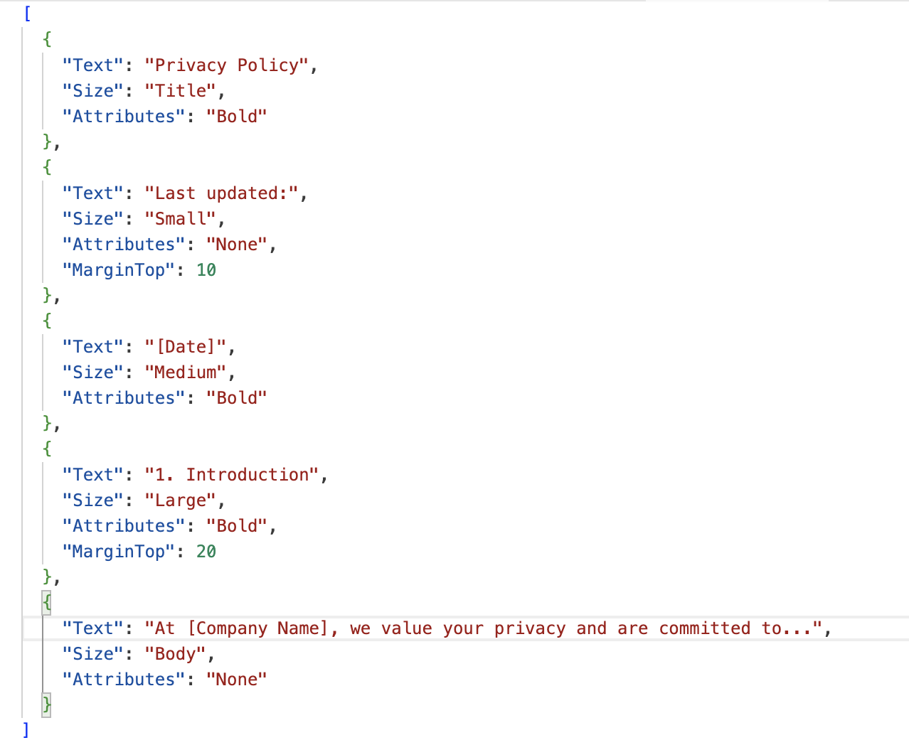

🇺🇸 EN | [🇪🇸 ES](README.es.md)

# JsonVisualizer

JsonVisualizer is a utility for .NET MAUI that allows you to dynamically create a CollectionView from JSON files. The JSON files should be located in `Resources/Raw/`.

<div style="margin: 20px 0;">
    
</div>

## Features

- Dynamically load any resource JSON file

## Installation

To install JsonVisualizer, run the following command in the NuGet Package Manager Console:

```sh
dotnet add package FreakzDEV.JsonVisualizer --version 1.0.2
```

<div style="margin: 20px 0;">
  <a href="https://www.nuget.org/packages/FreakzDEV.JsonVisualizer" style="text-decoration: none;color: #004880;">
    <div style="display: inline-flex;gap:10px;align-items: center;">
      
      <span style="font-weight: 900; font-size: 20px;">Nuget Package</span>
    </div>
  </a>
</div>

## Version

Current version: 1.0.2

## Properties
<table style="border: 1px solid #4d4d4d50;">
  <tr style="font-weight: 900;background-color:#4d4d4d20;"><td>Property</td><td>Description</td><td>Default Value</td></tr>
  <tr><td style="font-weight: 600;">File</td><td>Defines the name of Json Resource File: [File].json.</td><td>string.Empty</td></tr>
  <tr>
</table>

## JSON file structure
```json
[
  {
    "Text": "This is the title", // string
    "Size": "Title", // Small | Medium | Large | Title | Default
    "Attributes": "Bold", // Bold | Italic | None
    "marginTop": 20 // double
  }
]
```

In the `assets` directory, there is a sample JSON file named `Test.json`.

<div style="margin: 20px 0;">
  
</div>

## Usage

First, add the namespace to your XAML file:

```xml
xmlns:JsonVisualizer="clr-namespace:FreakzDEV.JsonVisualizer;assembly=FreakzDEV.JsonVisualizer"
```

Then, you can use the `JsonVisualizer` control in your XAML:

```xml
<JsonVisualizer:Collection File="{Binding JsonFile}" />
```

## Example

Here is an example of how to use the JsonVisualizer library in your .NET MAUI application:

```xml
<?xml version="1.0" encoding="utf-8" ?>
<ContentPage 
  xmlns="http://schemas.microsoft.com/dotnet/2021/maui"
  xmlns:x="http://schemas.microsoft.com/winfx/2009/xaml"
  x:Class="App.Devs.View"
  xmlns:local="clr-namespace:App.Devs"
  ios:Page.UseSafeArea="False"
  x:DataType="local:ViewModel"
  xmlns:JsonVisualizer="clr-namespace:FreakzDEV.JsonVisualizer;assembly=FreakzDEV.JsonVisualizer">
  <ScrollView>
    <VerticalStackLayout Padding="20,40,20,40" VerticalOptions="Fill" HorizontalOptions="Fill">
      <JsonVisualizer:Collection File="{Binding JsonFile}" Margin="0,20,0,0"/>
    </VerticalStackLayout>
  </ScrollView>
</ContentPage>
```
## Sample

<div style="margin: 20px 0;">
    
</div>

## License

This project is licensed under the MIT License.

## Contact

For any questions or feedback, please contact us at [support@freakz.dev](mailto:support@freakz.dev).